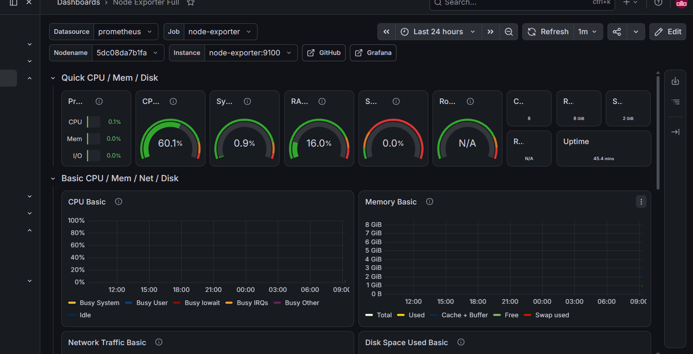
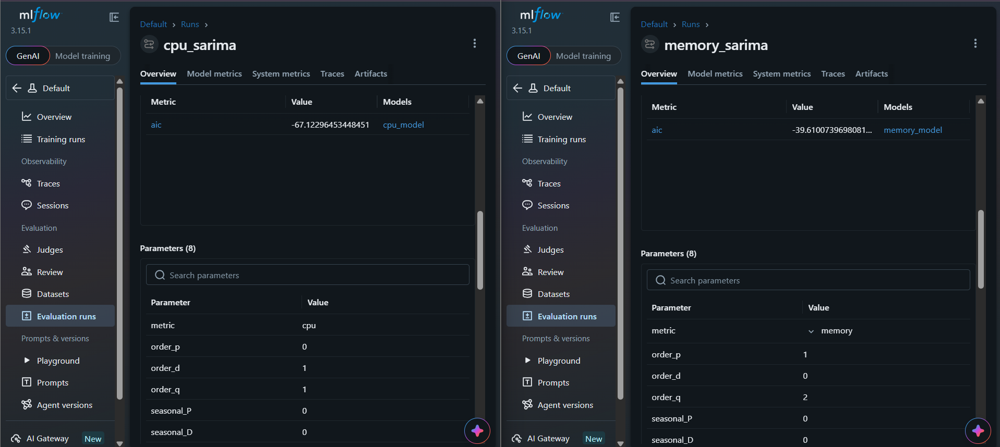
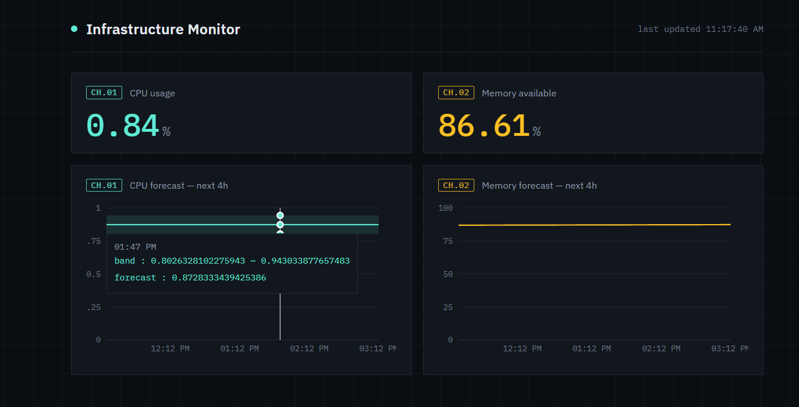

# Real-Time Infrastructure Monitoring & Forecasting System

A dual-pipeline observability system that combines live infrastructure monitoring with ML-based forecasting of CPU and memory usage.

## What it does

- **Live monitoring** — real-time CPU, memory, disk, and network metrics via a Prometheus/Grafana stack
- **Forecasting** — predicts CPU and memory usage 4 hours ahead using SARIMA time-series models, tracked with MLflow
- **Dashboard** — a custom React frontend displaying live metrics and forecasts, served by a FastAPI backend

## Architecture

The project runs two independent data pipelines feeding into a shared product layer:

LIVE PATH (real-time monitoring)
node-exporter → Prometheus → Grafana

BATCH PATH (forecasting)
Telegraf → InfluxDB → ingestion.py → pre_processing.py → SARIMA model → MLflow

PRODUCT LAYER
FastAPI (serves live metrics + forecasts) → React dashboard

**Why two separate collection paths?** node-exporter/Prometheus uses a pull-based model — ideal for real-time dashboards and alerting. Telegraf/InfluxDB uses a push-based model, better suited for feeding a long-term data store used for ML training. Each tool is used the way it's designed to be used, rather than forcing one pattern everywhere.

## Screenshots

**Live monitoring (Grafana)**

**ML experiment tracking (MLflow)**

**Dashboard (React + FastAPI)**

## Tech stack

| Layer | Tools |
|---|---|
| Live monitoring | node-exporter, Prometheus, Grafana |
| Data pipeline | Telegraf, InfluxDB, Python (pandas, influxdb-client) |
| ML | statsmodels (SARIMA), MLflow |
| Backend API | FastAPI |
| Frontend | React |
| Orchestration | Docker Compose |

## Key design decisions

- **SARIMA over deep learning** — chosen for interpretability and because it performs well on relatively small, univariate time series without needing large training datasets.
- **Grid search over (p,d,q)(P,D,Q,s)** — parameters are selected by minimizing AIC across a defined search space, rather than hand-picked.
- **Stationarity-driven differencing** — the `d` parameter for each metric is set based on an Augmented Dickey-Fuller test, not assumed.
- **MLflow tracking** — every training run logs its parameters, AIC score, and the fitted model artifact, so any model can be traced back to the exact code version (via git commit) that produced it.
- **Secrets management** — all credentials are loaded from environment variables (`.env`, gitignored), both on the Python side and in Docker Compose.

## Running it locally

**Prerequisites:** Docker Desktop, Python 3.11+, Node.js

1. Clone the repo and create a `.env` file (see `.env.example` for required variables)
2. Start the infrastructure:

docker-compose up -d

3. Set up the Python environment:

python -m venv venv
.\venv\Scripts\Activate.ps1 # or source venv/bin/activate on Mac/Linux
pip install -r requirements.txt

4. Run the data pipeline:

python src/ingestion.py
python src/pre_processing.py
python src/model_train.py

5. Start the API:

uvicorn src.api:app --reload --port 8000

6. Start the frontend:

cd frontend
npm install
npm start

## Ports

| Service | URL |
|---|---|
| React dashboard | http://localhost:3001 |
| Grafana | http://localhost:3000 |
| Prometheus | http://localhost:9090 |
| InfluxDB | http://localhost:8086 |
| FastAPI (docs at `/docs`) | http://localhost:8000 |
| MLflow UI | http://localhost:5000 |

Note: React's default port (3000) may conflict with Grafana or other local services — the app will prompt to use an alternate port (typically 3001) if 3000 is unavailable.

## Known limitations

- Forecasts are currently trained on a limited data window; the seasonal component of SARIMA will become more meaningful once more historical data accumulates (ideally several days, for a full daily cycle at 5-minute intervals).
- Retraining is currently manual (`python src/model_train.py`); a natural next step would be a scheduler for automated periodic retraining.

## Possible future improvements

- Automated retraining via a scheduler (cron or a lightweight Python loop)
- Real Grafana alert rules on top of the existing metrics
- Deploying the React frontend separately for a live public demo

Save this as README.md in your project root. Once saved, let's generate requirements.txt:

pip freeze > requirements.txt